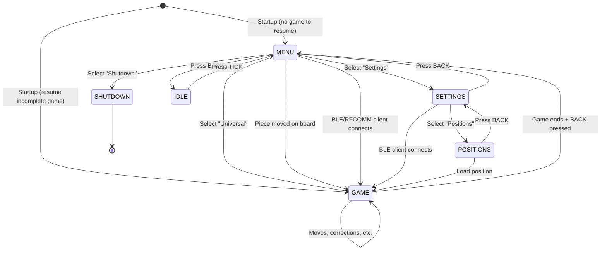
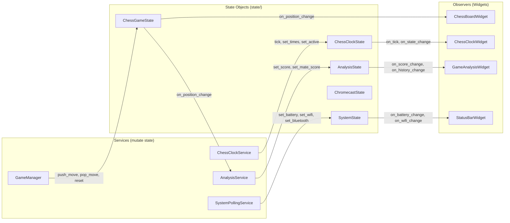
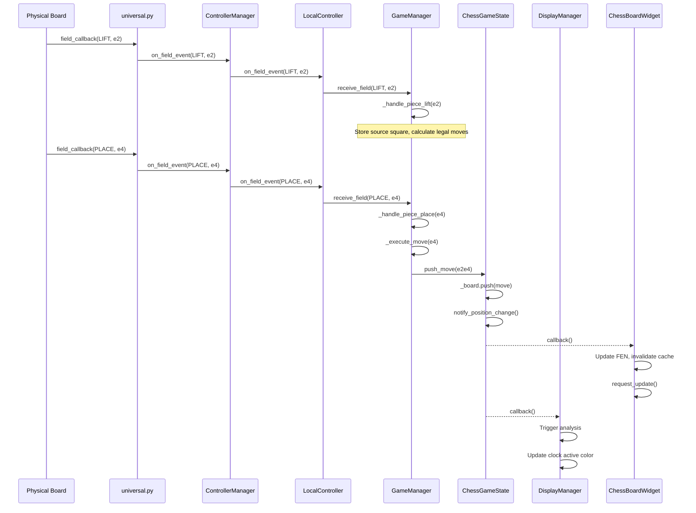
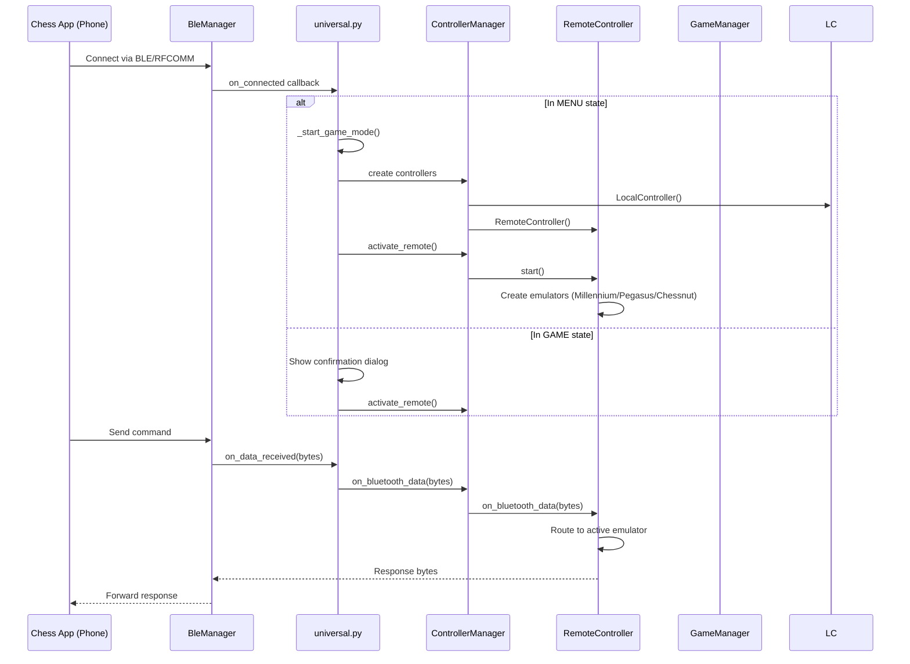
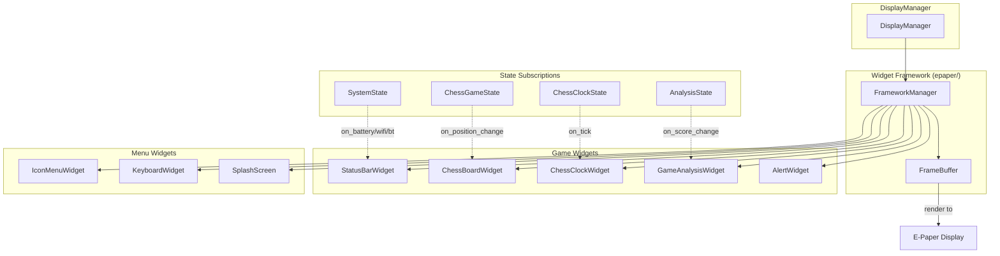
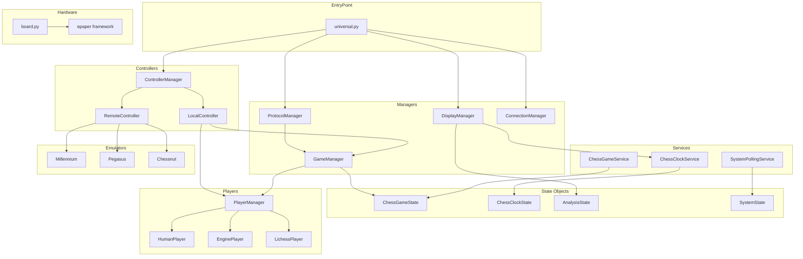
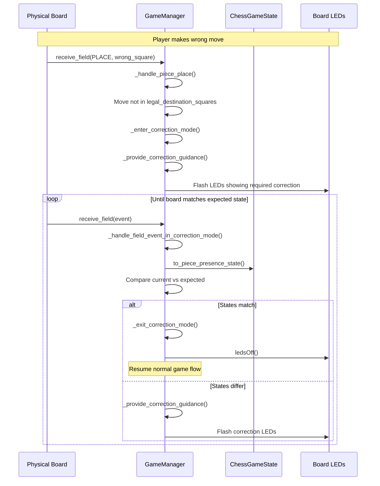
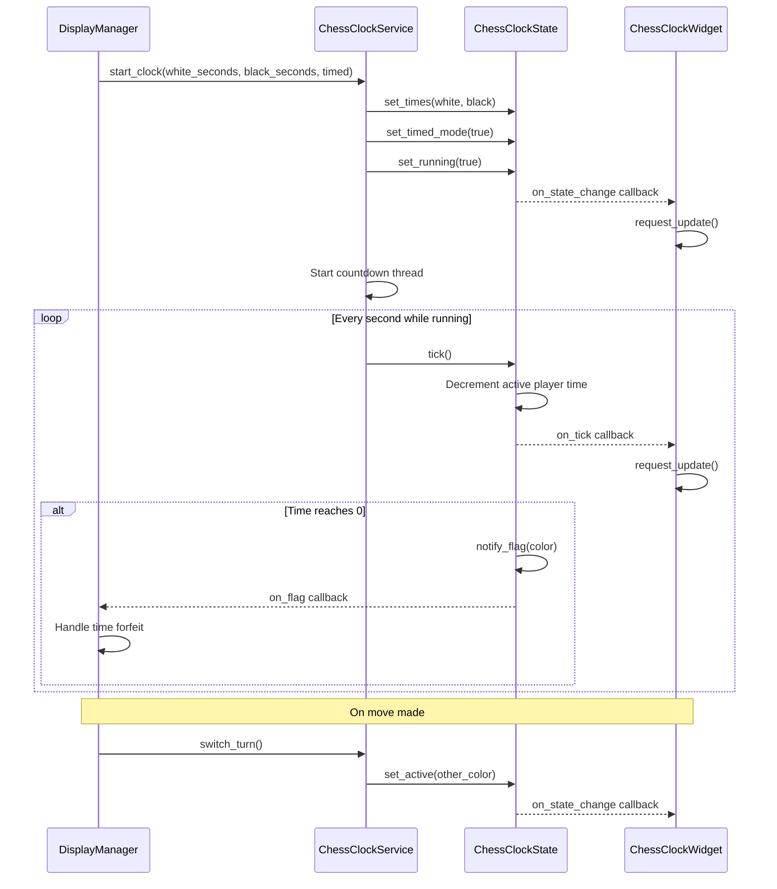
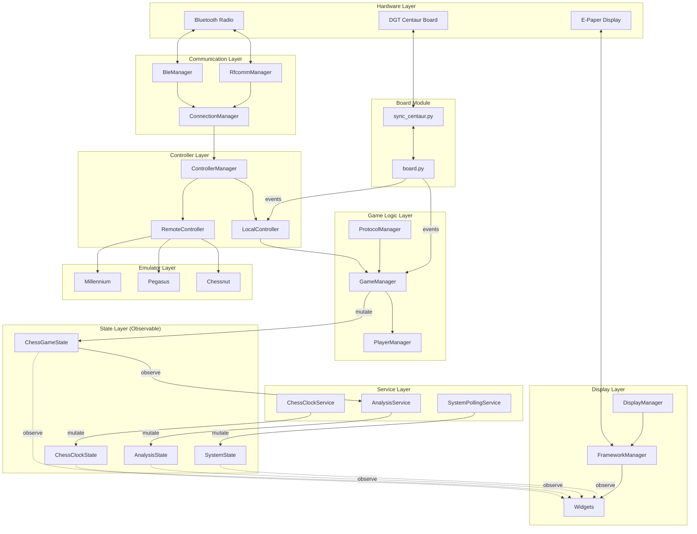

# Universal Chess - Architecture Diagrams

## 1. Application Startup Flow

```mermaid
flowchart TD
    subgraph Startup["Application Startup"]
        A[main.py entry] --> B[Parse Arguments]
        B --> C[Load Game Settings]
        C --> D[Initialize Display Manager]
        D --> E[Show Splash Screen]
        E --> F[Subscribe Board Events]
        F --> G[Register Signal Handlers]
        G --> H[Start Services]
        
        subgraph Services["Service Initialization"]
            H --> H1[SystemPollingService]
            H --> H2[ChessGameService]
        end
        
        H1 --> I[Initialize BLE Manager]
        H2 --> I
        I --> J[Start BLE Mainloop Thread]
        J --> K[Initialize RFCOMM Thread]
        K --> L{Check Incomplete Game?}
        
        L -->|Yes| M[Resume Game]
        L -->|No| N[Show Main Menu]
        
        M --> O[AppState = GAME]
        N --> P[AppState = MENU]
    end
```

## 2. Main Application State Machine

## 3. State Objects and Observer Pattern

## 4. Game Event Flow (Move Execution)

## 5. Bluetooth Connection Flow

## 6. Display Widget Hierarchy

## 7. Module Dependencies

## 8. Correction Mode Flow

## 9. Clock Service Flow

## 10. Complete System Overview

## Key Architectural Principles

1. **State Objects are the Single Source of Truth**
   - All game state lives in `ChessGameState`
   - All clock state lives in `ChessClockState`
   - Widgets observe state, never mutate it

2. **Mutations Only Through State Methods**
   - `push_move()`, `pop_move()`, `reset()`, `set_position()`
   - Methods automatically notify observers
   - No direct field access from outside

3. **Observer Pattern for UI Updates**
   - Widgets subscribe to state changes
   - State notifies all observers on mutation
   - Decouples game logic from display logic

4. **Controller Abstraction**
   - `LocalController` handles local play (human + engine)
   - `RemoteController` handles Bluetooth app connections
   - `ControllerManager` switches between them

5. **Service Layer for Background Tasks**
   - `ChessClockService` manages countdown thread
   - `SystemPollingService` polls battery/wifi/bluetooth
   - Services mutate state, state notifies widgets
